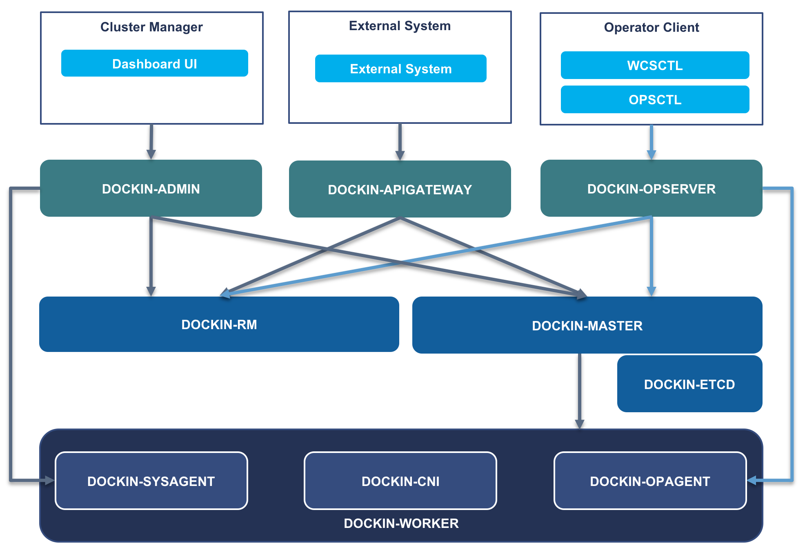

# Dockin Installer - Dockin Platform Installer

[](https://www.apache.org/licenses/LICENSE-2.0.html)

[English](README.md) | 中文

Dockin平台安装器，快速部署高可用kubernetes集群、ETCD集群，生产级参数调优。

**更多Dockin组件请访问 [https://github.com/WeBankFinTech/Dockin](https://github.com/WeBankFinTech/Dockin)**



## Features

* **0.1.0**
    * 支持ETCD高可用离线部署
    * 支持Kubernetes高可用离线部署
    * 支持Docker离线部署
    * 关闭kernel memory accounting
    * 全链路支持HTTPS
    * 10年证书签名

## Installation

### Minimum Requirements

* **OS**
  * centos ≥  7 
  * kernel ≥ 3.10

## QuickStart

### 下载release包

- 在release页下载对应的release包

### 安装ETCD

- 解压至目录：dockin-etcd
- 默认部署路径：/data/app/dockin-etcd
- 证书生成路径：/data/app/dockin-etcd/conf
- 配置：conf/install.properties
- 默认端口：5379
- 命令

```
修改配置文件 vi conf/install.properties
按格式填写参数：server_list=(ip1 ip2 ip3)
```

```
sudo ./install.sh 
```

### 安装Docker

- 解压至目录：dockin-docker
- 配置文件：无
- 命令

```
cd dockin-docker
sudo ./install.sh

```

### 安装WORKER组件

- 解压至目录：dockin-worker
- 配置：conf/install.properties

```
#本机IP
ip=[@HOSTIP]

# 加入集群的token，通过master的脚本产生
token=[#join-token]

# Master ApiServer IP/VIP
master=[#master-vip]
```

- 命令

```
cd dockin-worker
#若非master节点master_node参数需要改成false
sudo ./install.sh install v1.16.6 master_node=true

```


### 安装K8S Master

- 解压至目录：dockin-master
- 配置：conf/install.properties

```
# master HA VIP
master_vip=[#MASTER_VIP]

# masterIP and VIP
master_ip_list=[#MASTER_IP_LIST]

# local IP
local_ip=[@HOSTIP]

# etcd list, eg: https://ip1:port1,https://ip2:port2,https://ip3:port3; 
# 请注意dockin-etcd的端口是5379
etcd_list=[#ETCD_LIST]
```

- ETCD证书地址：/etc/kubernetes/pki/etcd/

```
# 需要包含以下文件，从ETCD节点/data/app/dockin-etcd/conf路径下获取
ca.pem client.pem client-key.pem
```

- 命令

```
cd dockin-master
# 如果不是第一个节点，请将first_node设置成false
sudo ./install.sh install v1.16.6 first_node=true
```

### 使用外部负载均衡器

使用云厂商提供的LB、自建haproxy、自建nginx都可以接入apiserver，作为高可用负载均衡器
